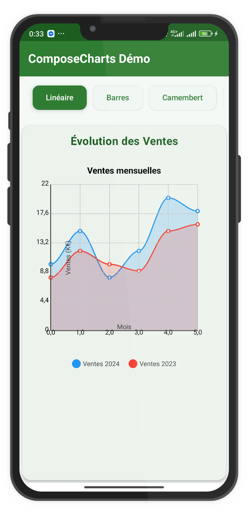
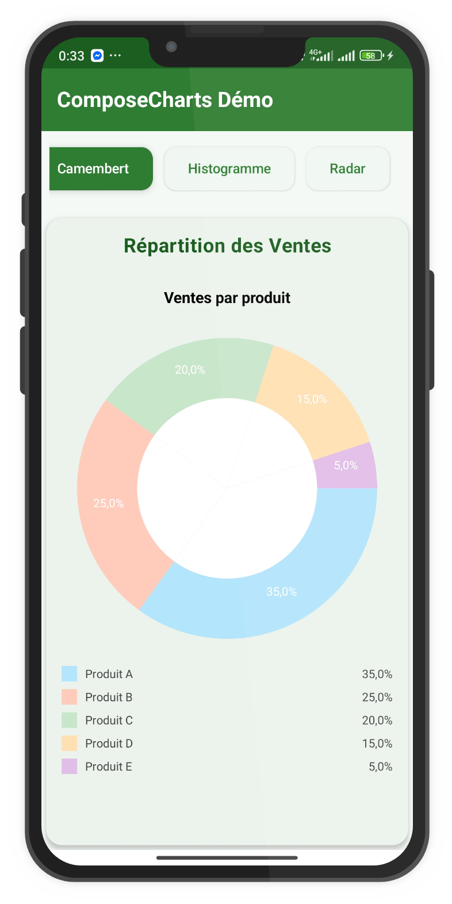
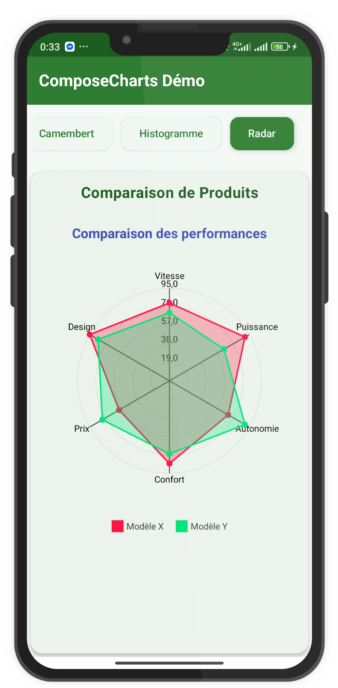
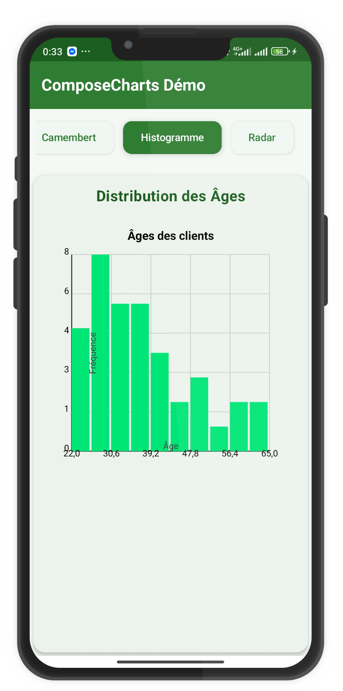
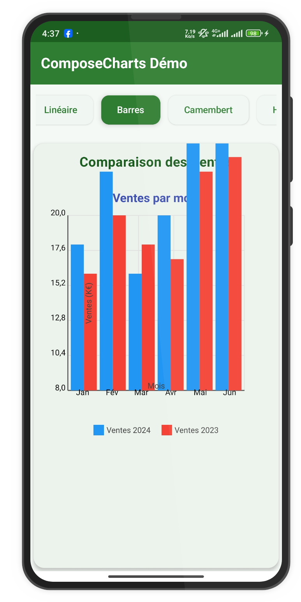
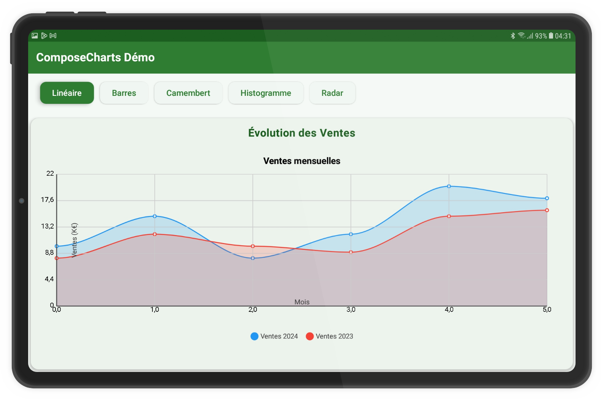
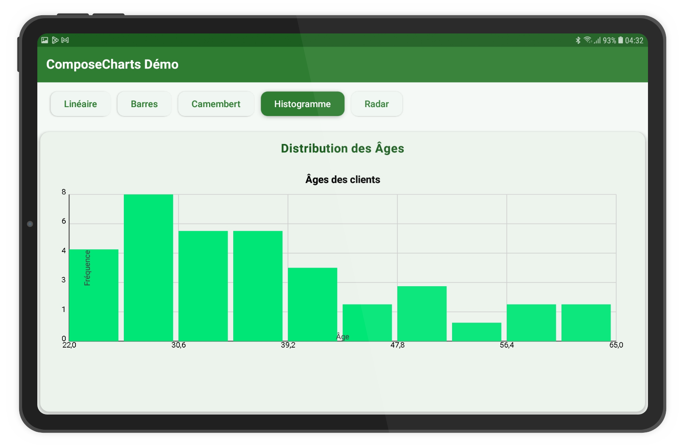
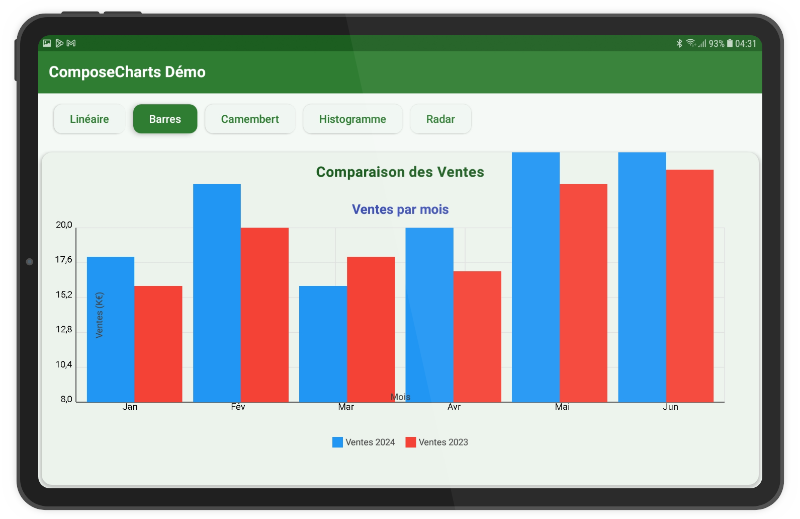

# ComposeCharts

[](https://jitpack.io/#2zalab/composecharts)
[](https://opensource.org/licenses/MIT)
[](https://android-arsenal.com/api?level=21)

ComposeCharts is a modern and powerful data visualization library for Jetpack Compose. It allows you to easily create interactive, animated, and customizable charts for your Android applications.

## Features

- **5 chart types**: Line, bar, pie, histogram, and radar charts
- **Smooth animations**: Animated transitions for all visualizations
- **High customization**: Control every aspect of your charts' appearance
- **User interactions**: Selection, tooltips, zoom, and pan
- **Predefined themes**: Compatible with light/dark themes and Material 3
- **Simple and intuitive API**: Easy to integrate into your Compose projects
- **Data utilities**: Functions to transform and analyze your data

## Demonstration

For concrete examples of how to use this library, please visit our demonstration repository:

[ComposeChartsDemo](https://github.com/2zalab/composechartsDemo/)

This repository contains several examples of charts implemented with Jetpack Compose, including:
- Line charts
- Histograms
- Bar charts
- Pie charts
- Radar charts

You'll also find examples of responsive layouts for different screen sizes.
## Gallery

### Mobile Screens
<div align="center">
  <p>
    
    
    
    
    
  </p>
</div>

### Tablet Screens
<div align="center">
  <p>
    
    
    
  </p>
</div>

## Installation

### 1. Add the JitPack repository

Add the JitPack repository to your `settings.gradle` or `settings.gradle.kts` file at the root of your project:

```kotlin
dependencyResolutionManagement {
    repositoriesMode.set(RepositoriesMode.FAIL_ON_PROJECT_REPOS)
    repositories {
        google()
        mavenCentral()
        maven { url = uri("https://jitpack.io") }
    }
}
```

Or if you're using the older configuration, add it in your project-level `build.gradle` file:

```groovy
allprojects {
    repositories {
        google()
        mavenCentral()
        maven { url 'https://jitpack.io' }
    }
}
```

### 2. Add the dependency

Add the dependency in your module-level `build.gradle` file:

```groovy
dependencies {
    implementation 'com.github.2zalab:composecharts:1.0.0'
}
```

Or with Kotlin DSL:

```kotlin
dependencies {
    implementation("com.github.2zalab:composecharts:1.0.0")
}
```

## Usage

### Line Chart

The Line Chart displays data as a series of points connected by straight or curved lines. It's ideal for showing trends over time or continuous data.

```kotlin
import com.touzalab.composecharts.components.LineChart
import com.touzalab.composecharts.data.DataPoint
import com.touzalab.composecharts.data.DataSeries
import com.touzalab.composecharts.theme.ColorPalettes

// Create data
val dataSeries = listOf(
    DataSeries(
        name = "Sales 2024",
        color = ColorPalettes.Default[0],
        points = listOf(
            DataPoint(x = 0f, y = 10f, label = "Jan"),
            DataPoint(x = 1f, y = 15f, label = "Feb"),
            DataPoint(x = 2f, y = 8f, label = "Mar"),
            DataPoint(x = 3f, y = 12f, label = "Apr"),
            DataPoint(x = 4f, y = 20f, label = "May"),
            DataPoint(x = 5f, y = 18f, label = "Jun")
        )
    ),
    DataSeries(
        name = "Sales 2023",
        color = ColorPalettes.Default[1],
        points = listOf(
            DataPoint(x = 0f, y = 8f, label = "Jan"),
            DataPoint(x = 1f, y = 12f, label = "Feb"),
            DataPoint(x = 2f, y = 10f, label = "Mar"),
            DataPoint(x = 3f, y = 9f, label = "Apr"),
            DataPoint(x = 4f, y = 15f, label = "May"),
            DataPoint(x = 5f, y = 16f, label = "Jun")
        )
    )
)

// Use the composable
LineChart(
    dataSeries = dataSeries,
    title = "Sales Evolution",
    xAxisTitle = "Month",
    yAxisTitle = "Sales (K$)",
    smoothCurve = true,
    showPoints = true,
    fillArea = true
)
```

#### Line Chart Parameters

| Parameter | Type | Default | Description |
|-----------|------|---------|-------------|
| `dataSeries` | `List<DataSeries>` | required | List of data series to display |
| `modifier` | `Modifier` | `Modifier` | Compose modifier for the chart |
| `style` | `ChartStyle` | `ChartStyle()` | Style configuration for the chart |
| `title` | `String?` | `null` | Chart title (optional) |
| `xAxisTitle` | `String?` | `null` | X-axis title (optional) |
| `yAxisTitle` | `String?` | `null` | Y-axis title (optional) |
| `smoothCurve` | `Boolean` | `true` | If true, curves are smoothed using Bézier interpolation |
| `showPoints` | `Boolean` | `true` | If true, displays data points |
| `fillArea` | `Boolean` | `false` | If true, fills the area under the curve |
| `showLegend` | `Boolean` | `true` | If true, displays the legend |
| `showGrid` | `Boolean` | `true` | If true, displays the background grid |
| `showTooltip` | `Boolean` | `true` | If true, displays tooltips on tap/hover |
| `yAxisRange` | `Pair<Float, Float>?` | `null` | Custom Y-axis range (min, max), if null, calculated automatically |
| `pointRadius` | `Float` | `4f` | Radius of data points |
| `lineWidth` | `Float` | `2f` | Width of the lines |

### Bar Chart

The Bar Chart represents data with rectangular bars, where the length or height of each bar is proportional to the value it represents. It's useful for comparing discrete categories.

```kotlin
import com.touzalab.composecharts.components.BarChart

BarChart(
    dataSeries = dataSeries,
    title = "Sales Comparison",
    xAxisTitle = "Month",
    yAxisTitle = "Sales (K$)",
    stacked = false,
    horizontal = false
)
```

#### Bar Chart Parameters

| Parameter | Type | Default | Description |
|-----------|------|---------|-------------|
| `dataSeries` | `List<DataSeries>` | required | List of data series to display |
| `modifier` | `Modifier` | `Modifier` | Compose modifier for the chart |
| `style` | `ChartStyle` | `ChartStyle()` | Style configuration for the chart |
| `title` | `String?` | `null` | Chart title (optional) |
| `xAxisTitle` | `String?` | `null` | X-axis title (optional) |
| `yAxisTitle` | `String?` | `null` | Y-axis title (optional) |
| `horizontal` | `Boolean` | `false` | If true, displays bars horizontally |
| `stacked` | `Boolean` | `false` | If true, stacks the data series |
| `showLegend` | `Boolean` | `true` | If true, displays the legend |
| `yAxisRange` | `Pair<Float, Float>?` | `null` | Custom Y-axis range (min, max), if null, calculated automatically |
| `barSpacing` | `Float` | `0.1f` | Spacing between bars as a proportion of bar width |
| `barCornerRadius` | `Float` | `0f` | Corner radius for the bars |
| `showValue` | `Boolean` | `false` | If true, displays values on top of the bars |

### Pie Chart

The Pie Chart displays data as slices of a circle, where each slice represents a proportion of the whole. It's ideal for showing composition of a total.

```kotlin
import com.touzalab.composecharts.components.PieChart
import com.touzalab.composecharts.data.PieChartSegment

val segments = listOf(
    PieChartSegment(label = "Product A", value = 35f, color = ColorPalettes.Default[0]),
    PieChartSegment(label = "Product B", value = 25f, color = ColorPalettes.Default[1]),
    PieChartSegment(label = "Product C", value = 20f, color = ColorPalettes.Default[2]),
    PieChartSegment(label = "Product D", value = 20f, color = ColorPalettes.Default[3])
)

PieChart(
    segments = segments,
    title = "Sales Distribution",
    donut = true,
    showPercentages = true
)
```

#### Pie Chart Parameters

| Parameter | Type | Default | Description |
|-----------|------|---------|-------------|
| `segments` | `List<PieChartSegment>` | required | List of segments to display |
| `modifier` | `Modifier` | `Modifier` | Compose modifier for the chart |
| `style` | `ChartStyle` | `ChartStyle()` | Style configuration for the chart |
| `donut` | `Boolean` | `false` | If true, displays as a donut chart |
| `donutRatio` | `Float` | `0.6f` | Inner to outer radius ratio for donut chart (between 0 and 1) |
| `title` | `String?` | `null` | Chart title (optional) |
| `showPercentages` | `Boolean` | `true` | If true, displays percentages on the chart |
| `showLegend` | `Boolean` | `true` | If true, displays the legend |
| `rotationDegrees` | `Float` | `0f` | Initial rotation in degrees |
| `highlightSelection` | `Boolean` | `true` | If true, highlights the selected segment |
| `explodeSelection` | `Boolean` | `false` | If true, explodes the selected segment outward |
| `explodeOffset` | `Float` | `20f` | Offset distance for exploded segments |

### Histogram

The Histogram displays the distribution of continuous data by dividing it into bins and showing the frequency of values within each bin.

```kotlin
import com.touzalab.composecharts.components.Histogram

val data = listOf(12f, 15f, 18f, 19f, 20f, 22f, 25f, 26f, 27f, 28f, 
                  30f, 31f, 32f, 35f, 37f, 40f, 42f, 45f, 48f, 50f)

Histogram(
    data = data,
    title = "Age Distribution",
    xAxisTitle = "Age",
    yAxisTitle = "Frequency",
    bins = 8,
    barColor = ColorPalettes.Default[0]
)
```

#### Histogram Parameters

| Parameter | Type | Default | Description |
|-----------|------|---------|-------------|
| `data` | `List<Float>` | required | List of values to distribute into the histogram |
| `modifier` | `Modifier` | `Modifier` | Compose modifier for the chart |
| `style` | `ChartStyle` | `ChartStyle()` | Style configuration for the chart |
| `title` | `String?` | `null` | Chart title (optional) |
| `xAxisTitle` | `String?` | `null` | X-axis title (optional) |
| `yAxisTitle` | `String?` | `null` | Y-axis title (optional) |
| `barColor` | `Color` | `Color.Blue` | Color of the histogram bars |
| `bins` | `Int` | `10` | Number of bins (groups) for the histogram |
| `customRange` | `Pair<Float, Float>?` | `null` | Custom data range (min, max), if null, calculated automatically |
| `showValues` | `Boolean` | `false` | If true, displays bin counts above bars |
| `density` | `Boolean` | `false` | If true, shows density instead of counts |
| `cumulative` | `Boolean` | `false` | If true, shows cumulative distribution |
| `barSpacing` | `Float` | `0.05f` | Spacing between bars as a proportion of bar width |

### Radar Chart

The Radar Chart (also known as Spider or Web Chart) displays multivariate data as a two-dimensional chart with three or more quantitative variables, represented on axes starting from the same point.

```kotlin
import com.touzalab.composecharts.components.RadarChart

val categories = listOf("Speed", "Power", "Range", "Comfort", "Price", "Design")
val dataSeries = listOf(
    DataSeries(
        name = "Model X",
        color = ColorPalettes.Default[0],
        points = listOf(
            DataPoint(x = 0f, y = 80f, label = "Speed"),
            DataPoint(x = 1f, y = 90f, label = "Power"),
            DataPoint(x = 2f, y = 70f, label = "Range"),
            DataPoint(x = 3f, y = 85f, label = "Comfort"),
            DataPoint(x = 4f, y = 60f, label = "Price"),
            DataPoint(x = 5f, y = 95f, label = "Design")
        )
    ),
    DataSeries(
        name = "Model Y",
        color = ColorPalettes.Default[1],
        points = listOf(
            DataPoint(x = 0f, y = 70f, label = "Speed"),
            DataPoint(x = 1f, y = 65f, label = "Power"),
            DataPoint(x = 2f, y = 90f, label = "Range"),
            DataPoint(x = 3f, y = 75f, label = "Comfort"),
            DataPoint(x = 4f, y = 80f, label = "Price"),
            DataPoint(x = 5f, y = 85f, label = "Design")
        )
    )
)

RadarChart(
    dataSeries = dataSeries,
    categories = categories,
    title = "Product Comparison",
    fillArea = true,
    showPoints = true
)
```

#### Radar Chart Parameters

| Parameter | Type | Default | Description |
|-----------|------|---------|-------------|
| `dataSeries` | `List<DataSeries>` | required | List of data series to display |
| `categories` | `List<String>` | required | List of category names (axes) |
| `modifier` | `Modifier` | `Modifier` | Compose modifier for the chart |
| `style` | `ChartStyle` | `ChartStyle()` | Style configuration for the chart |
| `title` | `String?` | `null` | Chart title (optional) |
| `maxValue` | `Float?` | `null` | Maximum value on axes, if null, calculated automatically |
| `showLegend` | `Boolean` | `true` | If true, displays the legend |
| `fillArea` | `Boolean` | `true` | If true, fills the polygons |
| `showPoints` | `Boolean` | `true` | If true, displays points on the axes |
| `showAxes` | `Boolean` | `true` | If true, displays the axes |
| `showAxisLabels` | `Boolean` | `true` | If true, displays labels on axes |
| `showWebLines` | `Boolean` | `true` | If true, displays concentric polygons |
| `rotationDegrees` | `Float` | `0f` | Initial rotation in degrees |

## Customization

### Styles

You can customize every aspect of the charts using the `ChartStyle` class:

```kotlin
import com.touzalab.composecharts.style.ChartStyle
import androidx.compose.ui.graphics.Color
import androidx.compose.ui.text.TextStyle
import androidx.compose.ui.unit.sp

val customStyle = ChartStyle(
    backgroundColor = Color.White,
    gridColor = Color.LightGray.copy(alpha = 0.5f),
    axisColor = Color.DarkGray,
    titleStyle = TextStyle(
        color = Color(0xFF3F51B5),
        fontSize = 18.sp,
        fontWeight = FontWeight.Bold
    ),
    // Other customizable properties...
)

LineChart(
    dataSeries = dataSeries,
    style = customStyle,
    // ...
)
```

### Predefined Themes

The library includes several predefined themes:

```kotlin
import com.touzalab.composecharts.theme.ChartThemes

LineChart(
    dataSeries = dataSeries,
    style = ChartThemes.Dark,  // Dark theme
    // ...
)

// Available themes: Light, Dark, Colorful, Minimal
```

### Color Palettes

Use predefined color palettes or create your own:

```kotlin
import com.touzalab.composecharts.theme.ColorPalettes

// Use a predefined palette
val colors = ColorPalettes.Pastel

// Available palettes: Default, Pastel, Monochrome, Vibrant
```

## Utilities and Transformations

### Data Smoothing

```kotlin
import com.touzalab.composecharts.utils.ChartUtilities

val smoothedSeries = ChartUtilities.smoothSeries(dataSeries, windowSize = 3)
```

### Linear Regression

```kotlin
val trendLine = ChartUtilities.linearRegression(dataSeries)
```

### Statistics

```kotlin
val stats = ChartUtilities.calculateStatistics(values)
println("Mean: ${stats["mean"]}")
println("Median: ${stats["median"]}")
println("Standard Deviation: ${stats["stdDev"]}")
```

## Animation

Customize chart animations:

```kotlin
import com.touzalab.composecharts.animation.AnimationPresets

val chartStyle = ChartStyle(
    animationDuration = AnimationPresets.Fast.duration,
    animationEasing = AnimationPresets.Fast.easing
)
```

## Export

Export your charts in different formats:

```kotlin
import com.touzalab.composecharts.export.ExportUtils

// Export as PNG
val pngPath = ExportUtils.exportToPng(context, chartView, "my_chart")

// Export as PDF
val pdfPath = ExportUtils.exportToPdf(context, chartView, "my_chart")

// Export data as CSV
val csvPath = ExportUtils.exportToCsv(context, data, "my_data")
```

## Compatibility

- Android API 21+ (Android 5.0 Lollipop and higher)
- Jetpack Compose 1.5.0 and higher
- Kotlin 1.8.0 and higher

## Contributing

Contributions are welcome! Feel free to report bugs, suggest features, or submit pull requests.

1. Fork the project
2. Create your feature branch (`git checkout -b feature/amazing-feature`)
3. Commit your changes (`git commit -m 'Add amazing feature'`)
4. Push to the branch (`git push origin feature/amazing-feature`)
5. Open a Pull Request

## License

This project is licensed under the MIT License. See the [LICENSE](LICENSE) file for details.

```
MIT License

Copyright (c) 2025 2zaLab

Permission is hereby granted, free of charge, to any person obtaining a copy
of this software and associated documentation files...
```

## Authors

- **2zaLab** - [GitHub](https://github.com/2zalab)

## Acknowledgments

- The Jetpack Compose team for their excellent framework
- All contributors who have helped improve this library
